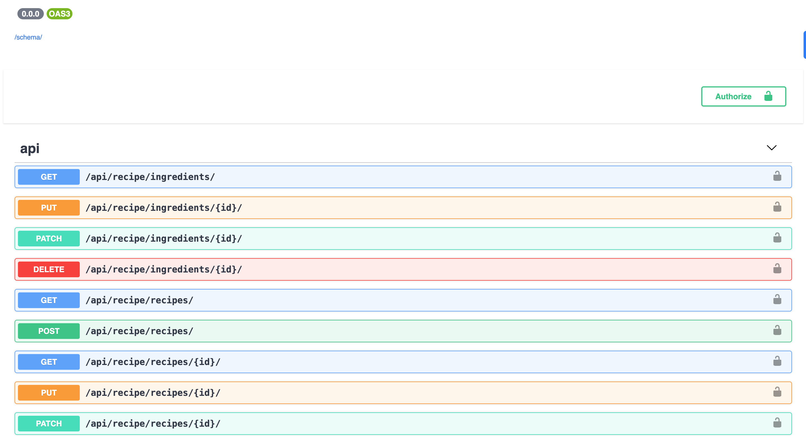
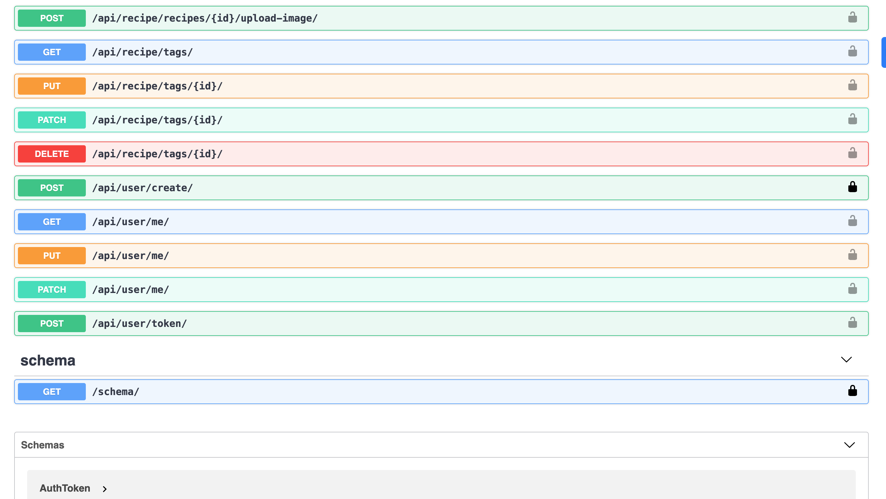
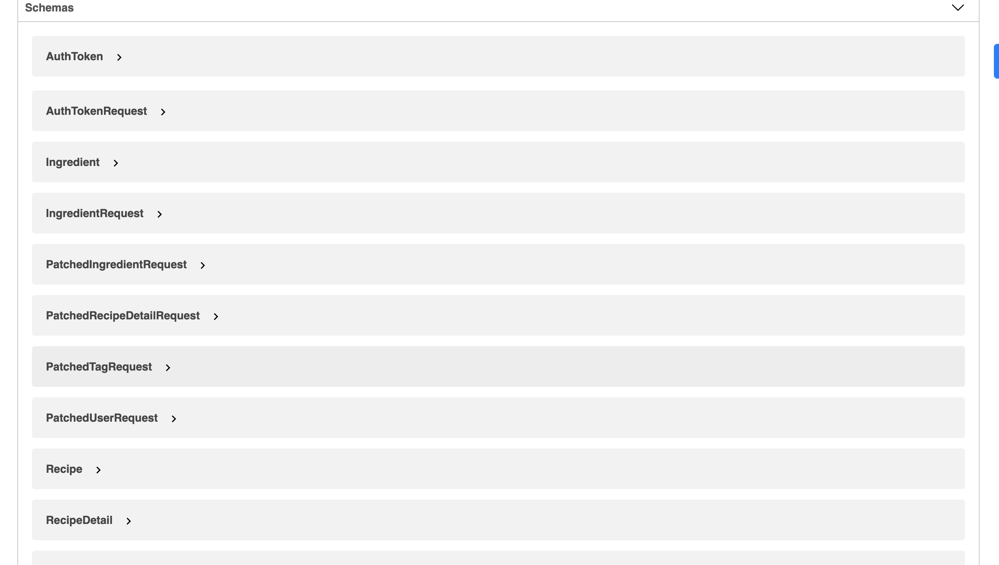

# ChefCode API

ChefCode API is a web application designed to manage recipes and cooking instructions. This project is built using Django and provides RESTful APIs for creating, reading, updating, and deleting recipes. Also included is user authentication and authorization, image upload for recipes, and ingredient management.

## Table of Contents

- [Features](#features)
- [Prerequisites](#prerequisites)
- [Technologies](#technologies)
- [API Endpoints](#api-endpoints)
- [Installation](#installation)
- [Running the Tests](#running-the-tests)
- [Deployment](#deployment)
- [Environment Variables](#environment-variables)
- [Author](#author)
- [Contributing](#contributing)
- [License](#license)

## Features

- User authentication and authorization.
- Recipe management: Create, read, update, and delete recipes.
- Ingredients management: Add and manage ingredients for each recipe.
- Image upload for recipes.
- RESTful API following best practices.
- Dockerized for easy setup and deployment.

## Prerequisites

Before you begin, ensure you have met the following requirements:

- Docker and Docker Compose installed.
- Python 3.8 or higher installed.
- Git installed.
- A code editor like Visual Studio Code.
- A terminal or command prompt.

## Technologies

The project is built using the following technologies:

- **Python**: Programming language used for the backend.
- **Django**: High-level Python web framework that encourages rapid development.
- **Django REST Framework**: Powerful and flexible toolkit for building Web APIs.
- **Docker**: Containerization platform that simplifies deployment.
- **PostgreSQL**: Relational database used for data storage.
- **Gunicorn**: Python WSGI HTTP Server for serving the application.
- **NGINX**: Web server used as a reverse proxy and load balancer.
- **Pytest**: Testing framework for Python.
- **Swagger**: API documentation tool.
- **GitHub Actions**: CI/CD tool for automating workflows.

## API Endpoints
#### API Endpoints
- Authentication
POST /api/auth/register/ - Register a new user.
POST /api/auth/login/ - Log in a user and get a token.
- Recipes
GET /api/recipes/ - Get a list of all recipes.
POST /api/recipes/ - Create a new recipe.
GET /api/recipes/{id}/ - Get a single recipe by ID.
PUT /api/recipes/{id}/ - Update a recipe by ID.
DELETE /api/recipes/{id}/ - Delete a recipe by ID.
- Ingredients
GET /api/ingredients/ - Get a list of all ingredients.
POST /api/ingredients/ - Create a new ingredient.
GET /api/ingredients/{id}/ - Get a single ingredient by ID.
PUT /api/ingredients/{id}/ - Update an ingredient by ID.
DELETE /api/ingredients/{id}/ - Delete an ingredient by ID.






#### Swagger Schema View
GET /swagger/ - API documentation using Swagger.



## Installation

1. Clone the repository:
bash

```
git clone https://github.com/DanSam5K/chef-code-API.git
```
```
cd chef-code-API
```

Create a .env file in the root directory and set your environment variables. You can use the .env.example file as a template.

Build and start the Docker containers:

## Running the Tests
To run the tests, execute the following command:
bash
```
docker-compose run app sh -c "python manage.py test && flake8"
```

## Deployment
Ensure your environment variables are correctly set in the .env file.
Build and start the Docker containers in detached mode:
bash
```
docker-compose -f docker-compose-deploy.yml up --build -d
```
#### Usage

You can access the API documentation at http://localhost:80/docs. or http://127.0.0.1/docs/

#### Login as super admin to access the admin panel
bash
```
docker-compose run --rm app sh -c "python manage.py createsuperuser"
```

You can access the Django admin panel at http://localhost:80/admin.

## Environment Variables
The following environment variables need to be set in your .env file:

DB_HOST: The database host.
DB_NAME: The name of the database.
DB_USER: The database user.
DB_PASS: The database password.
DJANGO_SECRET_KEY: The secret key for Django.
DJANGO_ALLOWED_HOSTS: A list of allowed hosts.

## Author

- Daniel Samuel

- GitHub: [DanSam5K](https://github.com/DanSam5K)
- LinkedIn: [Daniel Samuel](https://www.linkedin.com/in/dansamuel/)
- Email: dansam5000@gmail.com

## Contributing
Feel free to connect with me for any queries, suggestions, or collaborations.
Contributions are always welcome! Please follow these steps:

Fork the repository.
Create a new branch (git checkout -b feature-branch).
Make your changes.
Commit your changes (git commit -m 'Add some feature').
Push to the branch (git push origin feature-branch).
Create a Pull Request.

## License
This project is licensed under the MIT License. See the LICENSE file for more details.
